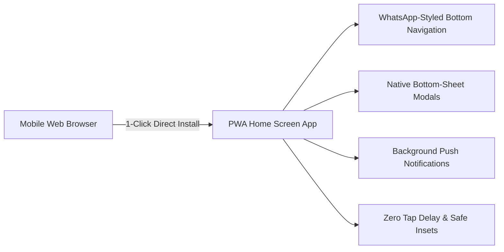
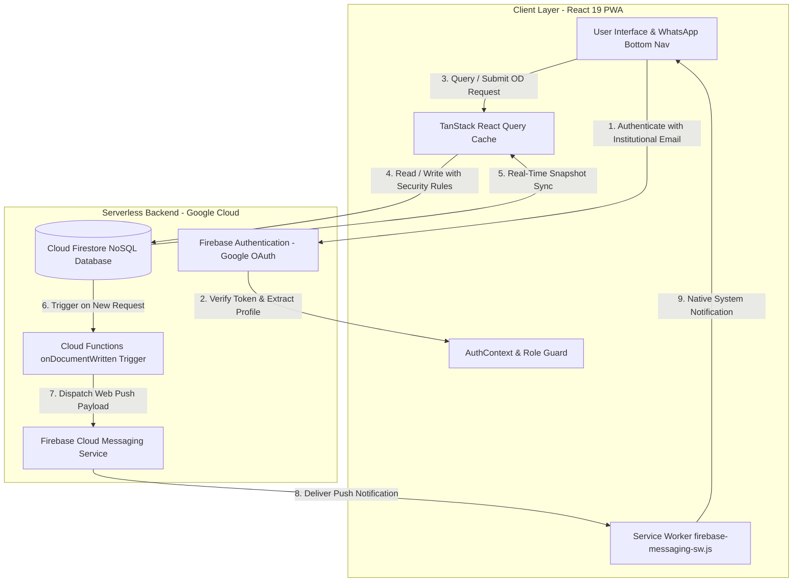

<div align="center">

  

  # 🎓 FX Movement Pass & On-Duty (OD) Portal
  ### *Digital Movement Pass, Attendance & Approval ERP System*
  
  **Francis Xavier Engineering College (Autonomous), Tirunelveli**  
  *Department of Computer Science & Engineering*

  <p align="center">
    <a href="#-key-features">Key Features</a> •
    <a href="#-technology-stack">Tech Stack</a> •
    <a href="#-system-architecture">Architecture</a> •
    <a href="#-mobile-first--pwa-capabilities">Mobile & PWA</a> •
    <a href="#-getting-started">Getting Started</a> •
    <a href="#-the-team">The Team</a>
  </p>

  <!-- Badges -->
  <p align="center">
    
    
    
    
    
    
    
    
  </p>

</div>

---

## 📌 Executive Overview

The **FX Movement Pass Portal** is an enterprise-grade, paperless On-Duty (OD) and movement pass governance platform developed for **Francis Xavier Engineering College**. 

Historically, student movement passes and on-duty permissions relied on manual paper slips, which led to signature delays, untracked classroom departures, lost physical records, and difficult end-of-semester attendance reconciliation. 

This platform transforms the movement pass workflow into a secure, multi-tier digital ERP ecosystem featuring:
- **Instant multi-tier approvals** (Student → Mentor → Head of Department).
- **Sub-period granularity**: Support for full-day and period-by-period passes (Periods 1–7).
- **Push notification delivery** via Firebase Cloud Messaging (FCM).
- **Native-grade Progressive Web App (PWA)** with a WhatsApp-styled mobile navigation bar and 1-click home screen installation.
- **Automated attendance auditing & reporting** with instant Excel (`.xlsx`) sheet generation.

---

## 🚀 Key Features

### 🎓 1. Student Portal
- **Flexible Pass Application**: Apply for single-day or multi-day passes with either Full-Day or Partial-Period schedules.
- **Proof Attachment**: Attach official event documents, symposium brochures, or external competition invitation letters.
- **Real-Time Request Tracker**: Visual multi-stage status tracker (Submitted ➔ Mentor Reviewed ➔ HOD Sanctioned).
- **Digital Pass Passcode / Verification**: Instant high-contrast digital pass screen suitable for faculty and security gate inspection.
- **Movement History & Notifications**: Chronological archives of all past applications with searchable filters.

### 👨‍🏫 2. Faculty Mentor Workspace
- **Mentees at a Glance**: Direct visibility into students assigned under each faculty mentor.
- **One-Hand Fast Review**: 1-tap approval/rejection with custom rejection rationale feedback.
- **Live Approval Counter**: Real-time red badge indicators in navigation for pending student applications.
- **Audit Logs**: Historical record of all reviewed passes with timestamped audit footprints.

### 🏛️ 3. Head of Department (HOD) Portal
- **Department-Wide Pass Oversight**: Centralized approval queue for passes approved by mentors.
- **Bulk Action Capabilities**: Multi-select bulk approval or rejection with a single click.
- **Departmental Analytics**: Visual breakdowns of movement passes categorized by Year, Section, Event Type, and Date.
- **Export to Excel**: Download formal attendance reconciliation spreadsheets ready for academic office submission.

### 🛡️ 4. Institutional Admin & Governance
- **Role-Based Access Control (RBAC)**: Enforced via Firebase Security Rules and client route guards (`STUDENT`, `MENTOR`, `HOD`, `ADMIN`, `PRINCIPAL`, `ACADEMIC_COORDINATOR`).
- **User Roster Management**: Batch CSV roster imports for fast semester onboarding.
- **Security Audit Logs**: Immutable system-wide logging for compliance and disciplinary audits.

---

## 📱 Mobile-First & PWA Capabilities

The platform is designed to look, feel, and behave like a high-performance native Android / iOS application.



- **WhatsApp-Styled Bottom Navigation**: Persistent bottom bar tailored to each user role, featuring active indicator pills, unread badge counters, and an elevated center action button for Students to apply for passes.
- **1-Click Native Installation**:
  - **Android / Chromium**: Uses `beforeinstallprompt` to trigger the native operating system install dialog directly from the login page.
  - **iOS Safari**: Clean interactive 3-step guidance sheet ("Add to Home Screen").
  - **Standalone Mode**: Automatic detection of standalone PWA execution.
- **Mobile Native Ergonomics**:
  - Dynamic viewport safe-area insets (`env(safe-area-inset-*)`) for notched displays and gesture home-bars.
  - Viewport-clamped notification bell popup that never clips off mobile screens.
  - Slide-up bottom sheets with iOS-style drag handles for pass detail inspections and rejection forms.
  - Elimination of 300ms double-tap delay (`touch-action: manipulation`) and `-webkit-tap-highlight-color: transparent`.

---

## 🛠️ Technology Stack

| Layer | Technology | Details / Purpose |
| :--- | :--- | :--- |
| **Frontend Framework** | **React 19** | Modern functional components, hooks, concurrent rendering |
| **Language** | **TypeScript 6** | End-to-end type safety, strict interface models (`ODRequest`, `UserProfile`) |
| **Build & Tooling** | **Vite 8** | Sub-second Hot Module Replacement (HMR) and optimized Rollup production bundling |
| **Styling & Design** | **Tailwind CSS v4** | Modern utility-first CSS engine with dark mode & HSL institutional palettes |
| **Database** | **Cloud Firestore** | Serverless real-time NoSQL document store with live snapshot subscriptions |
| **Authentication** | **Firebase Auth** | Official Google Workspace institutional OAuth and role resolution |
| **Serverless Functions** | **Cloud Functions (Node 18)** | Event-driven backend microservices for automated push dispatching |
| **Push Notifications** | **Firebase Cloud Messaging (FCM)** | Background & foreground Web Push Notifications via Service Workers |
| **Routing** | **React Router DOM v7** | Client-side routing with nested layout architecture and protected guards |
| **State & Cache** | **TanStack Query v5** | Server-state caching, automatic background invalidation, and optimistic mutations |
| **Forms & Validation** | **React Hook Form + Zod** | High-performance uncontrolled forms with runtime schema validation |
| **Data Export** | **SheetJS (`xlsx`)** | Client-side Excel `.xlsx` generator for faculty attendance registers |
| **Code Quality** | **Oxlint** | High-speed Rust-based linter enforcing clean code standards |

---

## 🏛️ System Architecture



---

## 📂 Repository Directory Structure

```text
fx-od-app/
├── public/                      # Static assets & PWA files
│   ├── favicon.svg              # Browser SVG favicon
│   ├── pwa-192x192.png          # High-resolution PWA icon (192px)
│   ├── pwa-512x512.png          # High-resolution PWA icon (512px)
│   ├── pwa-maskable-512x512.png # Android maskable icon (512px)
│   ├── apple-touch-icon.png     # iOS home screen touch icon
│   ├── manifest.json            # Web App Manifest (PWA config)
│   └── firebase-messaging-sw.js # Service worker (FCM Push & PWA Lifecycle)
├── functions/                   # Serverless Firebase Cloud Functions
│   ├── index.js                 # Push notification triggers on Firestore writes
│   └── package.json             # Cloud functions dependencies (firebase-admin)
├── src/
│   ├── assets/                  # Institutional crests and vector illustrations
│   ├── components/              # Modular UI components
│   │   ├── common/              # Button, Input, Select, TextArea, Badge, Modal
│   │   ├── layout/              # Navbar, Sidebar, BottomNav, NotificationBell
│   │   ├── tables/              # RequestsTable, MentorApprovalTable, StudentTable
│   │   └── od/                  # ODDetailsModal, ODTimeline, Passcard
│   ├── config/                  # Firebase SDK client initialization
│   ├── context/                 # AuthContext, ThemeContext, AppContext
│   ├── hooks/                   # useAuth, useODRequests, usePWAInstall, useTheme
│   ├── layouts/                 # MainLayout (Responsive Shell with BottomNav)
│   ├── pages/                   # Application views
│   │   ├── Login/               # Institutional Login & 1-Click PWA Install
│   │   ├── Dashboard/           # Universal role-based dashboard view
│   │   ├── Student/             # ApplyOD, MyRequests, History, Notifications
│   │   ├── Mentor/              # StudentsUnderMe, PendingApprovals, History
│   │   ├── HOD/                 # DepartmentStudents, PendingApprovals, Analytics
│   │   ├── Admin/               # UserManagement, HistoricalODViewer, AuditLogs
│   │   └── Profile/             # User Profile & Account Settings
│   ├── routes/                  # AppRoutes & ProtectedRoute (RBAC Guard)
│   ├── schemas/                 # Zod validation schemas
│   ├── services/                # Firebase Firestore and FCM service layer
│   ├── types/                   # TypeScript interfaces (OD, User, Role, Notice)
│   ├── utils/                   # Excel export, date formatters, sanitizers
│   ├── App.tsx                  # Root Providers (QueryClient, Theme, Auth)
│   ├── index.css                # Tailwind CSS v4 directives & safe area tokens
│   └── main.tsx                 # Application mount & Service Worker registration
├── index.html                   # HTML entry point, PWA meta tags & prompt pre-capture
├── vite.config.ts               # Vite bundler & Tailwind v4 plugin config
└── package.json                 # Project dependencies and build scripts
```

---

## ⚡ Getting Started

### Prerequisites
- **Node.js**: `v18.0.0` or higher (recommended: Node v20+ or v24)
- **npm**: `v9.0.0` or higher
- A modern web browser (Google Chrome, Microsoft Edge, Safari, Firefox)

### 1. Clone the Repository
```bash
git clone https://github.com/fxengg-od-app/fx-od-app.git
cd fx-od-app
```

### 2. Install Dependencies
```bash
npm install
```

### 3. Configure Environment Variables
Create a `.env` file in the root directory (refer to `.env.example`):
```env
VITE_FIREBASE_API_KEY=your_api_key
VITE_FIREBASE_AUTH_DOMAIN=your_project.firebaseapp.com
VITE_FIREBASE_PROJECT_ID=your_project_id
VITE_FIREBASE_STORAGE_BUCKET=your_project.firebasestorage.app
VITE_FIREBASE_MESSAGING_SENDER_ID=your_sender_id
VITE_FIREBASE_APP_ID=your_app_id
VITE_FIREBASE_VAPID_KEY=your_fcm_web_push_vapid_key
```

### 4. Run Locally
```bash
npm run dev
```
Open [http://localhost:5173](http://localhost:5173) in your browser to view the application.

### 5. Production Build & Linting
```bash
# Check code quality with Oxlint
npm run lint

# Compile production bundle with Vite
npm run build

# Preview production build locally
npm run preview
```

---

## 👥 The Development Team

This project was engineered and maintained by students of **Francis Xavier Engineering College (Autonomous)**, Tirunelveli:

<div align="center">

| Developer | Role & Contributions | GitHub Profile |
| :--- | :--- | :--- |
| **Sam Joshua C** | **Lead Full-Stack Architect**<br>• Core architecture design & Firebase integration<br>• Authentication, state management & RBAC<br>• PWA installation flow & performance optimization | [](https://github.com/samjoshua7) |
| **Ramakrishna S** | **Frontend & Mobile UI Engineer**<br>• WhatsApp-styled mobile navigation & touch ergonomics<br>• Student & Mentor approval workflow components<br>• Responsive styling & modal bottom sheet overhaul | [](https://github.com/nijesh7) |
| **Sam Jeyas** | **Feature & Workflow Engineer**<br>• Movement pass scheduling logic (period-level granularity)<br>• OD history archives & filtering infrastructure<br>• Service layer & Firestore query pipelines | [](https://github.com/fxengg-od-app) |
| **Santhosh** | **UI/UX & Component Contributor**<br>• Layout scaffoldings & form validation integration<br>• Institutional branding assets & icon configurations<br>• Component modularization | [](https://github.com/fxengg-od-app) |
| **Vignesh** (`vigchen28`) | **QA & Workflow Testing Contributor**<br>• End-to-end user workflow testing & validation<br>• Request lifecycle QA & edge-case reporting<br>• Feature verification & feedback iteration | [](https://github.com/vigchen28) |

</div>

### Institutional Mentorship & Affiliation
- **Institution**: Francis Xavier Engineering College (Autonomous), Vannarpettai, Tirunelveli, Tamil Nadu, India.
- **Accreditation**: NBA Accredited, NAAC 'A' Grade, Approved by AICTE, Affiliated to Anna University.
- **Department**: Department of Computer Science & Engineering.

---

## 📄 License & Intellectual Property

This project is developed for institutional academic governance and operations at **Francis Xavier Engineering College**.  
All rights reserved © 2026.
